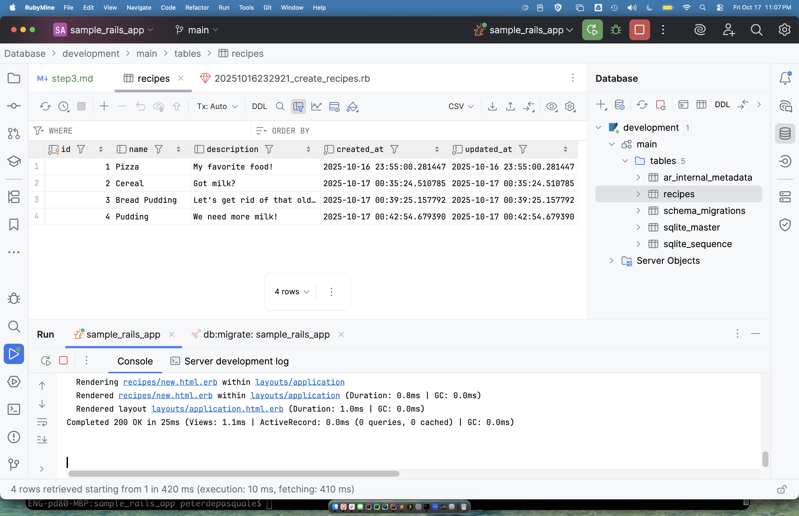

# Step 3 - Create Recipe Controller, Model, Views, and Routes

1. Create the `Recipes` controller and add the following code to support the next operations in the
[`controllers/recipes.rb`](app/controllers/recipes_controller.rb) file.
```ruby
class RecipesController < ApplicationController
  def new
  end

  def show
    @recipe = Recipe.find(params[:id])
  end

  def index
    @recipes = Recipe.all
  end

  def create
    @recipe = Recipe.new(recipe_params)
    @recipe.save
    redirect_to @recipe
  end

  private
  def recipe_params
    @recipe = params.require(:recipe).permit(:name, :description)
  end
end
```
2. Edit the [`views/recipes/index.html.erb`](app/views/recipes/index.html.erb) file and add the code for the
`index` view.
```erb
<h1>Recipes#index</h1>
<h1>Listing recipes</h1>
<%= link_to 'New recipe', new_recipe_path %>
<p></p>

<table>
  <tr>
    <th>Name</th>
    <th>Description</th>
  </tr>

  <% @recipes.each do |recipe| %>
    <tr>
      <td><%= recipe.name %></td>
      <td><%= recipe.description %></td>
      <td><%= link_to 'Show', recipe_path(recipe) %></td>
    </tr>
  <% end %>
</table>
```
3. Edit the [`views/recipes/new.html.erb`](app/views/recipes/new.html.erb) file and add the code to the `new` view.
```erb
<h1>Recipes#new</h1>
<%= form_for :recipe, url: recipes_path do |r| %>
<p>
    <%= r.label :name %><br>
    <%= r.text_field :name %>
</p>

<p>
    <%= r.label :description %><br>
    <%= r.text_area :description %>
</p>

<p>
    <%= r.submit %>
</p>
<% end %>
<%= link_to 'Back', recipes_path %>
```
4. Edit the [`views/recipes/show.html.erb`](app/views/recipes/show.html.erb) file and add the code to the `new` view.
```erb
<h1>Recipes#show</h1>
<p>
  <strong>Name:</strong>
  <%= @recipe.name %>
</p>

<p>
  <strong>Description:</strong>
  <%= @recipe.description %>
</p>
<%= link_to 'Back', recipes_path %>
```
5. Modify the [`views/welcome/index.html.erb`](/views/welcome/index.html.erb) file to add a link from the root/landing page to the `recipes`
list view.
```erb
<h4><%= link_to 'My Recipes', controller: 'recipes' %></h4>
```
6. Add a helper to automatically add relevent routes for the `recipes` controller in the
[`config/routes.rb`](config/routes.rb) file. Note that the rails generated may have also added a few `get` routes 
for us as well.
```ruby
resources :recipes
```
7. Finally, we need to create a database migration file to support the creation of the `recipes` database table. First, 
find the migration file created when we created the `Recipes` resource. Look in the [`db/migrate/`](db/migrate) directory. The filename
will vary, based on the time of creation but will likely have a name like 
`[20251016232921_create_recipes.rb](../db/migrate/20251016232921_create_recipes.rb)` Once you find the file, edit
it to add our data fields in the model.  We're adding a string field for the recipe `name` and a text field for
the `description`. Add two lines to the migration file.  Note that we're showing the whole file here, but only 
should need to add the two lines that define the additional text fields.
```ruby
class CreateRecipes < ActiveRecord::Migration[8.0]
  def change
    create_table :recipes do |t|
      t.string :name # shorter sequence of chars
      t.text :description # longer sequence of chars
      t.timestamps
    end
  end
end
```
8. Once the file is edited, let's run the migration and update the database. So via the IDE or command line we 
want to execute the `rake` command to migrate the latest and only migration file.
```unix
rake db:migration 
```
9. If you use the IDE, you can use the database viewer to connect to the db file
[`storage/development.sqlite3`](storage/development.sqlite3). Note the `file` text field that defined the path to
the `sqlite3` database file in our filesystem.

10. Once connected, you can use the viewer to see the structure and content of the database.

11. Verify the application by checking the following pages:
  * The root / landing page of the application: 'http://localhost:3000/'
  * From there should be able to follow the `My Recipes` link (`http://localhost:3000/recipes/index`) to a list of
recipes that have been entered. Depending on your prior testing, this may be an empty list.
  * Follow the `New Recipe` link to the form allowing you to create a new recipe (`http://localhost:3000/recipes/new`)
  * Enter some data and click `Save Recipe`. This should enter data to the database and put you back at the recipe
index page (`http://localhost:3000/recipes/index`)
  * Back on the listing page, locate your newly entered recipe and follow its `Show` link to the page showing just
that entry (`http://localhost:3000/recipes/1`)
  * Follow that page's `Back` link to return to the recipe index page.
  * Finally, the last link we did not test is the `Back` link on the `New Recipe` page. Be sure to check that
it works correctly, returning you to the recipe index.